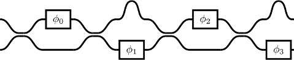

# ofit: **o**ptical **fi**lter **t**ool

This python program is designed to assist in the design and handling of optical filters. It can create filters that consist of couplers, phase shifters, delay elements, ring elements and crossing elements. From those, more complex structures can be constructed. Common composites like a (symmetric and asymmetric) Mach–Zehnder interferometer are available, too. Since this is a very specific topic in my research field, feel free to contact me or see my thesis for orientation ([s9w.io](http://www.s9w.io/))

The filters can then be drawn (via TikZ) and the transmission matrix containing the transfer functions be calculated.

## usage
There is an `example.py` file with some examples. Running it with `python example.py` will write the matrix and the image in the given filenames. The TikZ image can be used like any other TikZ code, an example is in the `example_document.tex`. Output of example file is matrix, plus a tex/pdf which should look like this:

